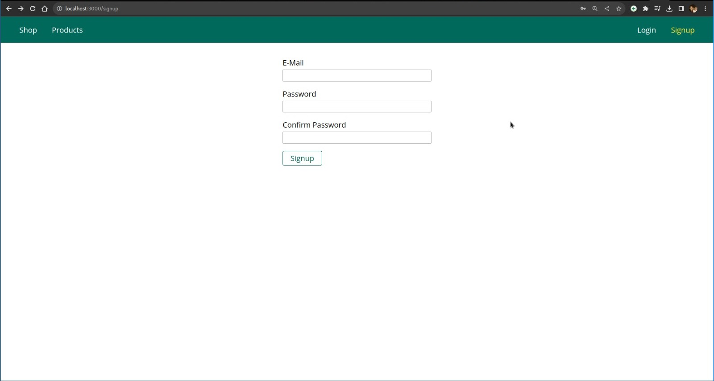
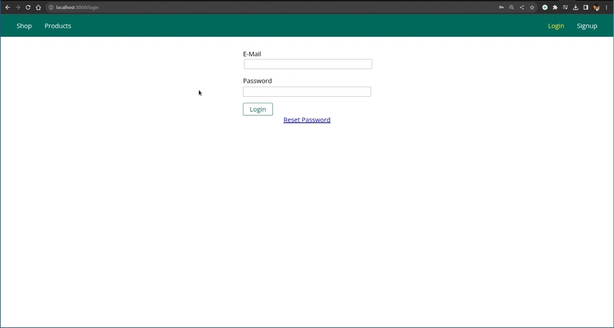
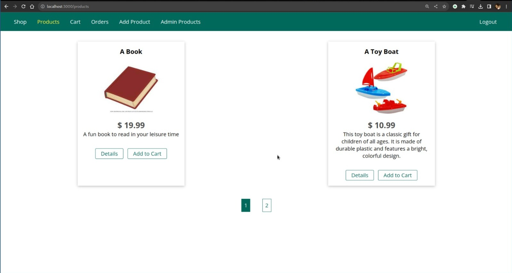
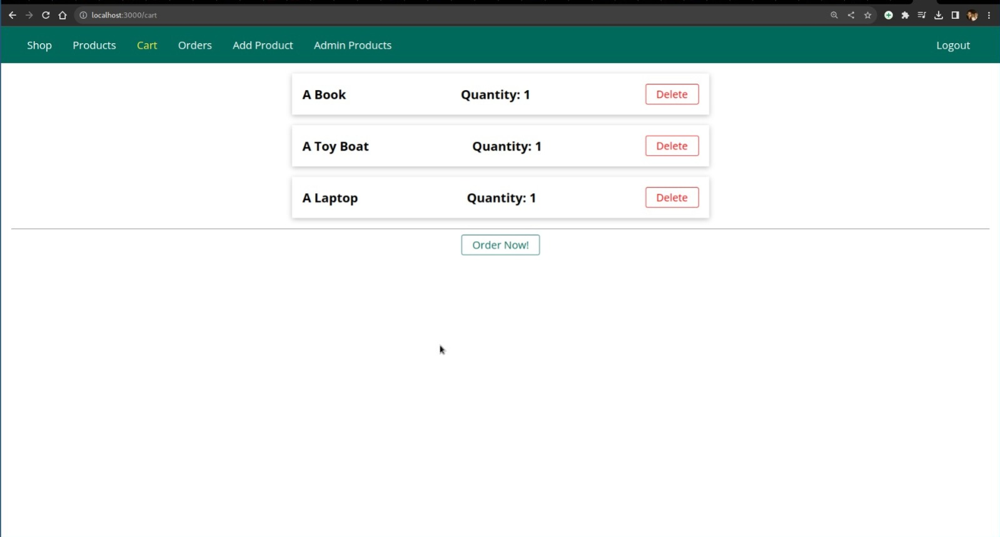
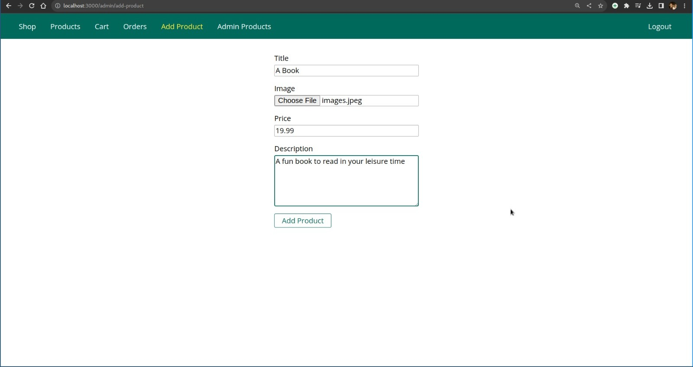
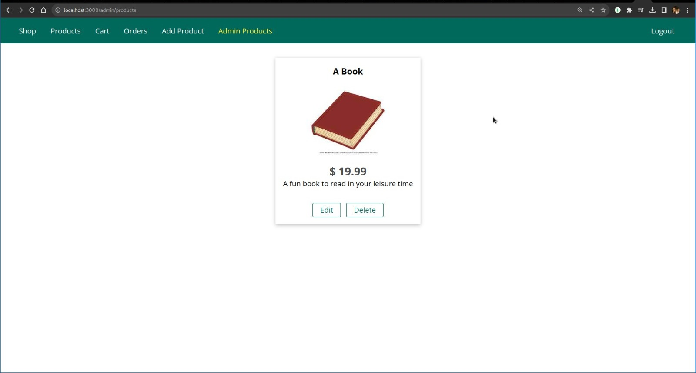

# E-Commerce Application

> An E-commerce web application built using NodeJS and MongoDB with a complete Admin panel and payment integration using the Stripe payment processing platform.

## Features

- User Registration and Authentication: Users can create accounts, log in, and manage their profiles.
- Product Catalog: Browse and search for products in various categories.
- Shopping Cart: Add products to the cart, review the cart, and proceed to checkout.
- Order Management: Place orders, view order history.
- Payment Integration: Seamless integration with the Stripe payment processing platform for secure and convenient payment transactions.
- Admin Panel: A comprehensive admin panel for managing products, orders, and user accounts.
- Responsive Design: The application is optimized for various devices, including desktop and mobile.

## Technologies Used

- Backend: NodeJS
- Database: MongoDB
- Frontend: HTML, CSS, JavaScript (EJS Templating Engine)
- Payment Integration: Stripe

## Installation

1. Clone the repository:

```
git clone https://github.com/vamshi5421
```

2. Navigate to the project directory:

```
cd node-com
```

3. Install dependencies:

```
npm install
```

4. Set up the environment variables:

   1. Fill in the necessary details for database configuration and Stripe API keys.
   2. Set up your preferred mailing service (Gmail OAuth or SendGrid API)

5. Start the server:

```
npm start
```

6. Access the application in your browser at `http://localhost:3000`

## App Previews

### SignUp



### LogIn



### Browse Products



### Cart



### Add Product (ADMIN)


### Manage Products (ADMIN)


